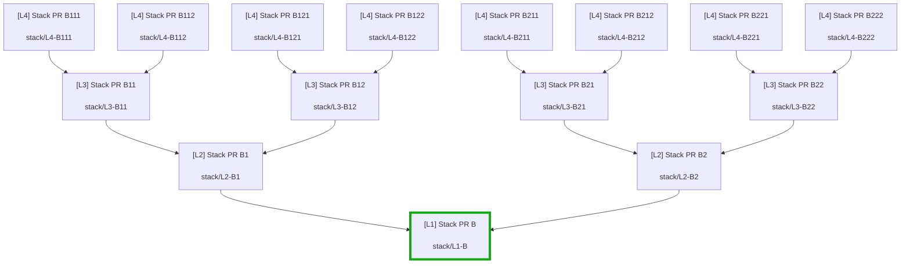

# Pull Request Mapper

VS Code / Cursor extension that maps stacked pull-request inheritance for the current workspace repository into a Mermaid flowchart.

## Requirements

- [GitHub CLI](https://cli.github.com/) (`gh`) installed and on your `PATH`
- Authenticated session: `gh auth login`
- A workspace folder that is a git clone of a GitHub repository

The extension talks to GitHub **only** through `gh`. It does not call the GitHub REST/GraphQL APIs directly.

## Usage

1. Open the repository folder in the IDE.
2. Run **PR Mapper: Map PR Stack** from the Command Palette (`Cmd+Shift+P` / `Ctrl+Shift+P`).
3. Pick a pull request. That PR is the root.
4. A new Markdown tab opens with a Mermaid flowchart of every **open** PR whose base branch is the selected PR’s head branch, then the same check recursively for each dependent.

Arrows point toward the merge base (`child --> parent`). Merge from the leaves toward the selected PR to land the full stack on its branch.

## Example

Against the private fixture repo [`martinshaw/pr-mapper-test`](https://github.com/martinshaw/pr-mapper-test) (4-layer stack, 2 children per parent), selecting **`#2 [L1] Stack PR B`** maps **14** dependent open PRs:



## How it works (request budget)

For a successful run the extension issues at most:

1. `gh --version` / `gh auth status` — install + auth checks (early return on failure)
2. `gh repo view` — resolve the workspace GitHub repo
3. `gh pr list --repo <repo> --state open --limit 1000 --json …` — **one** list of open PRs

The stack tree is built entirely in memory by matching `baseRefName` → `headRefName`. No per-PR fetches.

## Develop

```bash
npm install
npm run compile
```

Then launch **Run Extension** from the Debug view (F5) to open an Extension Development Host.

## Command

| Command ID | Title |
| --- | --- |
| `pull-request-mapper.mapPrStack` | PR Mapper: Map PR Stack |
