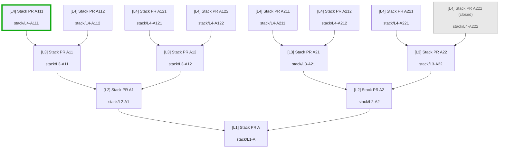

# Pull Request Mapper

Maps **stacked pull-request inheritance** into a Mermaid flowchart using only the [GitHub CLI](https://cli.github.com/) (`gh`).

## Example

Fixture repo, `closedPullRequests: grayedOut`, root `**#1` Stack PR A**, checkout `**stack/L4-A111`**, `**#22` A222** closed:



This repo provides two ways to get the same diagram:


|            | **VS Code / Cursor extension** | **Cursor Agent Skill**                                                 |
| ---------- | ------------------------------ | ---------------------------------------------------------------------- |
| **For**    | Interactive use in the IDE     | Agents (and CLI) in any git checkout                                   |
| **Where**  | Install / Run Extension (F5)   | `[.cursor/skills/pr-stack-mermaid/](.cursor/skills/pr-stack-mermaid/)` |
| **Output** | Markdown tab with Mermaid      | Upsert marked block in a README (or stdout)                            |


|                       |                                                                             |
| --------------------- | --------------------------------------------------------------------------- |
| **Primary command**   | `PR Mapper: Upsert Diagram to Current PR Description`                       |
| **Explore command**   | `PR Mapper: Map PR Stack`                                                   |
| **Fixture repo**      | `[martinshaw/pr-mapper-test](https://github.com/martinshaw/pr-mapper-test)` |
| **Version**           | 1.4.0                                                                       |


## Table of contents

- [Example](#example)
- [Requirements](#requirements)
- [Extension usage](#extension-usage)
- [Settings](#settings)
- [Cursor Agent Skill](#cursor-agent-skill)
  - [What’s included](#whats-included)
  - [Use in another project](#use-in-another-project)
  - [What to tell the agent](#what-to-tell-the-agent)
  - [Manual CLI (optional)](#manual-cli-optional)
  - [Script behavior](#script-behavior)
- [How it works](#how-it-works)
- [Develop](#develop)

## Requirements

Shared by the extension and the skill:

- `gh` on your `PATH`, authenticated (`gh auth login`)
- A workspace that is a git clone of a GitHub repository

Skill / CLI additionally needs **Node.js 18+** (`node` on `PATH`).

## Extension usage

### Upsert into the current PR description (primary)

Check out a PR branch, then run **PR Mapper: Upsert Diagram to Current PR Description**.

- Resolves the PR for the current branch with `gh pr view`
- Walks up to the stack root, maps dependents (per [Settings](#settings))
- Highlights the **current branch’s PR** (no highlight prompt)
- Upserts a marked Mermaid fence only (no preamble) at the top of that PR’s description via `gh pr edit --body-file` (inserts, or replaces if the markers already exist)

### Map PR Stack (interactive)

1. Run **PR Mapper: Map PR Stack**.
2. **Search** for the **stack root** (the picker stays empty until you type). Results come from `gh pr list --search` (open and closed PRs) and a GraphQL branch search via `gh api`. Branches that have no PR can be chosen as the inheritance root.
3. Pick the **highlight** node (checked-out branch pre-selected when present).
4. Choose output:
   - **Open Markdown tab** — full diagram document
   - **Insert or update to README** — upsert the Mermaid fence only (no preamble) into a root `README` / `README.*` (`.md`, `.markdown`, `.mdown`, `.mkdn`, `.mkd`, `.txt`, or no extension)

Arrows point toward the merge base (`child --> parent`).

## Settings

**Settings → Extensions → Pull Request Mapper**, or `settings.json`. Defaults match historical chart output (no extra filtering). The skill exposes the same knobs via CLI flags (see [Manual CLI](#manual-cli-optional)).

| Setting | Default | Values / notes |
| --- | --- | --- |
| `pullRequestMapper.closedPullRequests` | `exclude` | `exclude` · `grayedOut` · `normal` |
| `pullRequestMapper.maxDepth` | `0` | `0` = unlimited; otherwise max dependent levels below the root (root is level 0) |
| `pullRequestMapper.excludeDrafts` | `false` | When `true`, omit draft PRs |
| `pullRequestMapper.authorFilter` | `""` | If non-empty, only that GitHub login |
| `pullRequestMapper.labelFilter` | `""` | If non-empty, only PRs with that label name |

**Closed-PR modes**

- **`exclude`** — open PRs only (default).
- **`grayedOut`** — include closed/merged; muted Mermaid style + `(closed)` / `(merged)` in the label. Highlight stroke still applies (combined with gray when the current PR is closed).
- **`normal`** — include closed/merged with the same styling as open PRs.

Stack root is chosen via type-to-search each run; highlight is chosen from the mapped diagram nodes.

## Cursor Agent Skill

The extension does not run inside agent sessions in other repos. Use the bundled skill so an agent (or you, via CLI) can generate the same diagram elsewhere.

### What’s included

```text
.cursor/skills/pr-stack-mermaid/
├── SKILL.md                 # Agent instructions
└── scripts/
    ├── map-pr-stack         # bash wrapper
    ├── map-pr-stack.mjs     # CLI (gh + git); calls shared lib
    └── lib/stackMapper.js   # synced from src/stackMapper.ts on compile
```

Shared diagram logic lives in `src/stackMapper.ts` (extension + skill). `npm run compile` copies the built JS into the skill lib.

### Use in another project

**1. Install the skill** (pick one):

```bash
# One-liner (Cursor skills CLI) — installs into ~/.cursor/skills
npx skills add martinshaw/pull-request-mapper
```

Or copy from a clone:

```bash
git clone https://github.com/martinshaw/pull-request-mapper.git

# For use in all of your projects
mkdir -p ~/.cursor/skills
cp -R pull-request-mapper/.cursor/skills/pr-stack-mermaid ~/.cursor/skills/
chmod +x ~/.cursor/skills/pr-stack-mermaid/scripts/map-pr-stack

# Or — only one app repo
cd /path/to/your-app
mkdir -p .cursor/skills
cp -R /path/to/pull-request-mapper/.cursor/skills/pr-stack-mermaid .cursor/skills/
chmod +x .cursor/skills/pr-stack-mermaid/scripts/map-pr-stack
# (adjust /path/to/your-app to your project)
# (adjust /path/to/pull-request-mapper to where you cloned this repo)
```

Do **not** copy into `~/.cursor/skills-cursor/` (reserved for Cursor’s built-in skills).

**2. Open the other project** in Cursor (the repo whose PR stack you want mapped). Check out the PR branch you care about.

**3. Ask the agent** using the prompt in the next section. Cursor loads skills from `~/.cursor/skills/` and from the workspace’s `.cursor/skills/`.

**4. Result:** the agent runs `map-pr-stack --readme README.md` with cwd = that project. A marked section is inserted or replaced at the **top** of `README.md`:

```html
<!-- pr-stack-mermaid:start -->
… mermaid …
<!-- pr-stack-mermaid:end -->
```

Re-running the skill updates the same block in place.

### What to tell the agent

> Using the PR stack Mermaid skill, generate the diagram for the current branch’s stack and put it at the top of the README.

Optional: ask for closed PRs grayed out, e.g. “use `--closed grayedOut`”.

### Manual CLI (optional)

From the **target** repo (not this skill’s directory):

```bash
# Personal skill install
~/.cursor/skills/pr-stack-mermaid/scripts/map-pr-stack --readme README.md

# Project-local skill install
.cursor/skills/pr-stack-mermaid/scripts/map-pr-stack --readme README.md

# Print only
~/.cursor/skills/pr-stack-mermaid/scripts/map-pr-stack --stdout

# Closed/merged styling (same meanings as the extension setting)
~/.cursor/skills/pr-stack-mermaid/scripts/map-pr-stack --closed grayedOut --readme README.md

# Upsert into the current branch’s PR description (highlight = that PR; gh pr edit)
~/.cursor/skills/pr-stack-mermaid/scripts/map-pr-stack --pr-body --closed grayedOut

# Filters (defaults match the extension: unlimited depth, include drafts, no author/label filter)
~/.cursor/skills/pr-stack-mermaid/scripts/map-pr-stack --max-depth 3 --exclude-drafts --author alice --label stack

# Override root / highlight PR numbers (or use a branch with no PR as root)
~/.cursor/skills/pr-stack-mermaid/scripts/map-pr-stack --root 1 --highlight 15 --readme README.md
~/.cursor/skills/pr-stack-mermaid/scripts/map-pr-stack --root-branch main --highlight 15 --stdout
```

### Script behavior

| Step | Behavior |
| --- | --- |
| Current branch | `git rev-parse --abbrev-ref HEAD` |
| Highlight | PR whose `headRefName` matches that branch (or `--highlight`) |
| Stack root | Walk up `baseRefName` → another PR’s `headRefName` until none (or `--root` / `--root-branch`) |
| Dependents | PRs whose `baseRefName` equals the parent’s `headRefName` |
| Fetch | One `gh pr list` (`open` or `all` per `--closed`) |
| Filters | Shared `stackMapper` filters (`--max-depth`, `--exclude-drafts`, `--author`, `--label`) |
| Mermaid | Dense GFM fence; literal `\n` in labels; gray styles when `--closed grayedOut` |
| README | Upsert between the HTML comment markers; insert at file top if missing |

Change mapping rules in `src/stackMapper.ts`, then `npm run compile` (syncs the skill lib).

## How it works

`gh` only (no direct REST client). Typical calls:

1. `gh --version` / `gh auth status` — install + auth checks  
2. `gh repo view` — resolve `owner/name`  
3. `gh pr list --repo … --state <open|all> --limit 1000 --json …` — **one** list  
4. **Upsert to current PR:** `gh pr view` (current branch) + `gh pr edit --body-file` (write description)

The stack is built in memory by matching `baseRefName` → `headRefName`.

## Develop

```bash
npm install
npm run compile   # tsc + sync skill lib
npm test          # unit tests (no network / no gh)
```

Then **Run Extension** from the Debug view (F5) to open an Extension Development Host.

Skill package: [`.cursor/skills/pr-stack-mermaid/`](.cursor/skills/pr-stack-mermaid/). Re-install or re-copy after updates if you use a personal/project copy.

License: [GPL-3.0](LICENSE).