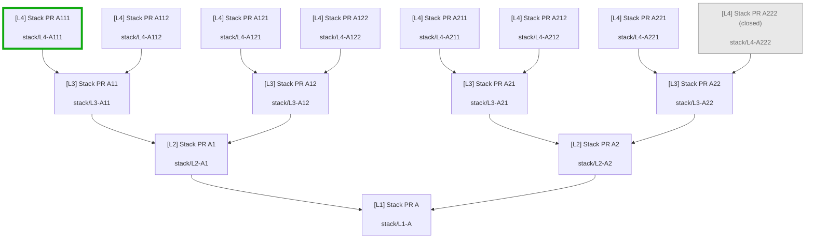

# Pull Request Mapper

VS Code / Cursor extension that maps stacked pull-request inheritance for the current workspace repository into a Mermaid flowchart.

## Requirements

- [GitHub CLI](https://cli.github.com/) (`gh`) installed and on your `PATH`
- Authenticated session: `gh auth login`
- A workspace folder that is a git clone of a GitHub repository

The extension talks to GitHub **only** through `gh`. It does not call the GitHub REST/GraphQL APIs directly.

## Usage

1. Open the repository folder in the IDE.
2. Run **PR Mapper: Map PR Stack** from the Command Palette (`Cmd+Shift+P` / `Ctrl+Shift+P`).
3. Pick a pull request. That PR is the stack root (map target).
4. Pick which PR in the stack to **highlight as current** (the Mermaid node letter used in the final `style …` line — typically the PR whose description you will paste the diagram into). The checked-out branch’s PR is pre-selected when it appears in the diagram; otherwise the stack root is.
5. A new Markdown tab opens with a Mermaid flowchart of every PR whose base branch is the selected PR’s head branch (subject to the closed-PR setting), then the same check recursively for each dependent.

Arrows point toward the merge base (`child --> parent`). Merge from the leaves toward the selected PR to land the full stack on its branch.

## Settings

Configure under **Settings → Extensions → Pull Request Mapper**, or in `settings.json`:

| Setting | Default | Values | Description |
| --- | --- | --- | --- |
| `pullRequestMapper.closedPullRequests` | `exclude` | `exclude` · `grayedOut` · `normal` | How **closed** and **merged** PRs appear in the stack diagram. |

**`exclude`** — only open PRs are fetched and drawn (original behavior).

**`grayedOut`** — open and closed/merged PRs are included. Closed/merged nodes use muted Mermaid styling (`fill` / `stroke` / `color` gray) and show `(closed)` / `(merged)` in the label. The highlighted “current” PR still gets the green stroke (combined with gray fill when that PR is closed).

**`normal`** — closed/merged PRs are included with the same styling as open PRs (state still appears in the label).

There are no other extension settings. The stack root and highlight node are chosen each time you run the command.

## Example

Against the fixture repo [`martinshaw/pr-mapper-test`](https://github.com/martinshaw/pr-mapper-test) (4-layer stack, 2 children per parent), with `pullRequestMapper.closedPullRequests` set to **`grayedOut`**, selecting **`#1 [L1] Stack PR A`**, checked out on **`stack/L4-A111`**, and with **`#22` A222** closed:



## How it works (request budget)

For a successful run the extension issues at most:

1. `gh --version` / `gh auth status` — install + auth checks (early return on failure)
2. `gh repo view` — resolve the workspace GitHub repo
3. `gh pr list --repo <repo> --state <open|all> --limit 1000 --json …` — **one** list (`open` when `closedPullRequests` is `exclude`, otherwise `all`)

The stack tree is built entirely in memory by matching `baseRefName` → `headRefName`. No per-PR fetches.

## Develop

```bash
npm install
npm run compile
```

Then launch **Run Extension** from the Debug view (F5) to open an Extension Development Host.

## Command

| Command ID | Title |
| --- | --- |
| `pull-request-mapper.mapPrStack` | PR Mapper: Map PR Stack |
