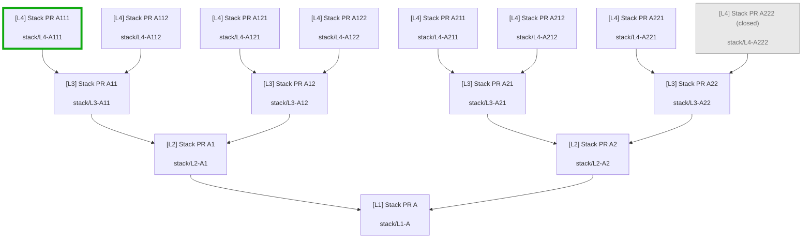

# Pull Request Mapper

Maps **stacked pull-request inheritance** into a Mermaid flowchart using only the [GitHub CLI](https://cli.github.com/) (`gh`).

## Example

Fixture repo, `closedPullRequests: grayedOut`, root `**#1` Stack PR A**, checkout `**stack/L4-A111`**, `**#22` A222** closed:



This repo provides two ways to get the same diagram:


|            | **VS Code / Cursor extension** | **Cursor Agent Skill**                                                 |
| ---------- | ------------------------------ | ---------------------------------------------------------------------- |
| **For**    | Interactive use in the IDE     | Agents (and CLI) in any git checkout                                   |
| **Where**  | Install / Run Extension (F5)   | `[.cursor/skills/pr-stack-mermaid/](.cursor/skills/pr-stack-mermaid/)` |
| **Output** | Markdown tab with Mermaid      | Upsert marked block in a README (or stdout)                            |


|                       |                                                                             |
| --------------------- | --------------------------------------------------------------------------- |
| **Extension command** | `PR Mapper: Map PR Stack` (`pull-request-mapper.mapPrStack`)                |
| **Fixture repo**      | `[martinshaw/pr-mapper-test](https://github.com/martinshaw/pr-mapper-test)` |
| **Version**           | 1.1.0                                                                       |


## Table of contents

- [Example](#example)
- [Requirements](#requirements)
- [Extension usage](#extension-usage)
- [Settings](#settings)
- [Cursor Agent Skill](#cursor-agent-skill)
  - [What’s included](#whats-included)
  - [Use in another project](#use-in-another-project)
  - [What to tell the agent](#what-to-tell-the-agent)
  - [Manual CLI (optional)](#manual-cli-optional)
  - [Script behavior](#script-behavior)
- [How it works](#how-it-works)
- [Develop](#develop)

## Requirements

Shared by the extension and the skill:

- `gh` on your `PATH`, authenticated (`gh auth login`)
- A workspace that is a git clone of a GitHub repository

Skill / CLI additionally needs **Node.js 18+** (`node` on `PATH`).

## Extension usage

1. Open the repository folder in the IDE.
2. Run **PR Mapper: Map PR Stack** from the Command Palette.
3. Pick the **stack root** (map target).
4. Pick which PR to **highlight as current** (Mermaid `style <letter> …`). The checked-out branch’s PR is pre-selected when it appears in the diagram; otherwise the stack root is.
5. A Markdown tab opens with the flowchart (subject to [Settings](#settings)).

Arrows point toward the merge base (`child --> parent`). Merge from the leaves toward the selected PR to land the full stack.

## Settings

Extension setting (**Settings → Extensions → Pull Request Mapper**, or `settings.json`). The skill uses the same modes via `--closed` (see [Manual CLI](#manual-cli-optional)).


| Setting                                | Default   | Values                             |
| -------------------------------------- | --------- | ---------------------------------- |
| `pullRequestMapper.closedPullRequests` | `exclude` | `exclude` · `grayedOut` · `normal` |


- `**exclude**` — open PRs only (default).
- `**grayedOut**` — include closed/merged; muted Mermaid style + `(closed)` / `(merged)` in the label. Highlight stroke still applies (combined with gray when the current PR is closed).
- `**normal**` — include closed/merged with the same styling as open PRs.

No other extension settings. Stack root and highlight node are chosen each run in the UI.

## Cursor Agent Skill

The extension does not run inside agent sessions in other repos. Use the bundled skill so an agent (or you, via CLI) can generate the same diagram elsewhere.

### What’s included

```text
.cursor/skills/pr-stack-mermaid/
├── SKILL.md                 # Agent instructions
└── scripts/
    ├── map-pr-stack         # bash wrapper
    └── map-pr-stack.mjs     # generator (gh + git + Node)
```

### Use in another project

**1. Install the skill** (pick one):

```bash
git clone https://github.com/martinshaw/pull-request-mapper.git

# For use in all of your projects
mkdir -p ~/.cursor/skills
cp -R pull-request-mapper/.cursor/skills/pr-stack-mermaid ~/.cursor/skills/
chmod +x ~/.cursor/skills/pr-stack-mermaid/scripts/map-pr-stack

# Or — only one app repo
cd /path/to/your-app
mkdir -p .cursor/skills
cp -R /path/to/pull-request-mapper/.cursor/skills/pr-stack-mermaid .cursor/skills/
chmod +x .cursor/skills/pr-stack-mermaid/scripts/map-pr-stack
# (adjust /path/to/your-app to your project)
# (adjust /path/to/pull-request-mapper to where you cloned this repo)
```

Do **not** copy into `~/.cursor/skills-cursor/` (reserved for Cursor’s built-in skills).

**2. Open the other project** in Cursor (the repo whose PR stack you want mapped). Check out the PR branch you care about.

**3. Ask the agent** using the prompt in the next section. Cursor loads skills from `~/.cursor/skills/` and from the workspace’s `.cursor/skills/`.

**4. Result:** the agent runs `map-pr-stack --readme README.md` with cwd = that project. A marked section is inserted or replaced at the **top** of `README.md`:

```html
<!-- pr-stack-mermaid:start -->
… mermaid …
<!-- pr-stack-mermaid:end -->
```

Re-running the skill updates the same block in place.

### What to tell the agent

> Using the PR stack Mermaid skill, generate the diagram for the current branch’s stack and put it at the top of the README.

Optional: ask for closed PRs grayed out, e.g. “use `--closed grayedOut`”.

### Manual CLI (optional)

From the **target** repo (not this skill’s directory):

```bash
# Personal skill install
~/.cursor/skills/pr-stack-mermaid/scripts/map-pr-stack --readme README.md

# Project-local skill install
.cursor/skills/pr-stack-mermaid/scripts/map-pr-stack --readme README.md

# Print only
~/.cursor/skills/pr-stack-mermaid/scripts/map-pr-stack --stdout

# Closed/merged styling (same meanings as the extension setting)
~/.cursor/skills/pr-stack-mermaid/scripts/map-pr-stack --closed grayedOut --readme README.md

# Override root / highlight PR numbers
~/.cursor/skills/pr-stack-mermaid/scripts/map-pr-stack --root 1 --highlight 15 --readme README.md
```

### Script behavior


| Step           | Behavior                                                                       |
| -------------- | ------------------------------------------------------------------------------ |
| Current branch | `git rev-parse --abbrev-ref HEAD`                                              |
| Highlight      | PR whose `headRefName` matches that branch (or `--highlight`)                  |
| Stack root     | Walk up `baseRefName` → another PR’s `headRefName` until none (or `--root`)    |
| Dependents     | PRs whose `baseRefName` equals the parent’s `headRefName`                      |
| Fetch          | One `gh pr list` (`open` or `all` per `--closed`)                              |
| Mermaid        | Dense GFM fence; literal `\n` in labels; gray styles when `--closed grayedOut` |
| README         | Upsert between the HTML comment markers; insert at file top if missing         |


The skill script and extension TypeScript are maintained in parallel. Prefer fixing agent behavior in the script; keep the extension UI aligned when rules change.

## How it works

At most three kinds of `gh` usage per successful run:

1. `gh --version` / `gh auth status` — install + auth checks
2. `gh repo view` — resolve `owner/name`
3. `gh pr list --repo … --state <open|all> --limit 1000 --json …` — **one** list

The stack is built in memory by matching `baseRefName` → `headRefName`. No per-PR fetches.

## Develop

```bash
npm install
npm run compile
```

Then **Run Extension** from the Debug view (F5) to open an Extension Development Host.

Skill changes live under `[.cursor/skills/pr-stack-mermaid/](.cursor/skills/pr-stack-mermaid/)`; re-copy to `~/.cursor/skills/` (or the other project) after updates.